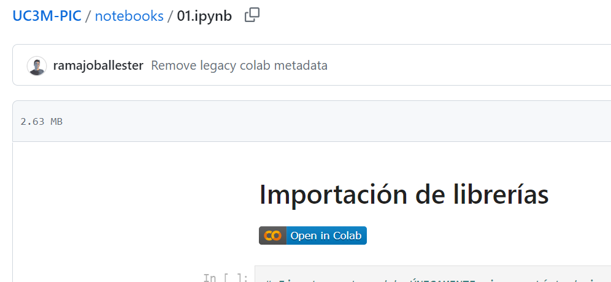

Google Colab
============

Para ejecutar los cuadernos de Jupyter en Google Colab, acceder a la carpeta `notebooks <https://github.com/ramajoballester/UC3M-PIC/notebooks>`_ y abrir mediante la etiqueta "Open in Colab".

|