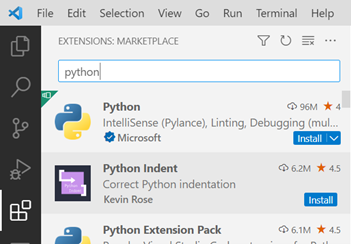
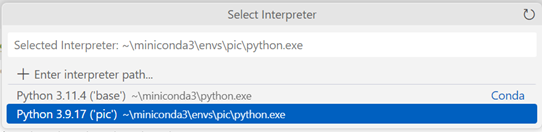

Configuración de Miniconda y VSCode
===================================

Miniconda
+++++++++

Conda es un gestor de entornos virtuales y librerías. Miniconda es la versión mínima del instalador de conda, la cual incluye únicamente Python, los paquetes de los que ambos dependen, y un reducido número de otros paquetes útiles. Anaconda, con una funcionalidad similar, realiza un consumo de almacenamiento más elevado, ya que incluye un mayor número de paquetes por defecto. Se recomienda usar miniconda, aunque ambos gestores son igualmente válidos para la asignatura.

Descarga e instalación
----------------------

.. tabs::

   .. group-tab:: Linux
      Antes de comenzar la instalación, se recomienda abrir la terminal (atajo\: Ctrl+Alt+T) y actualizar la lista de paquetes disponibles mediante:

      .. code-block:: bash

         sudo apt update

      A continuación, descargar el instalador de `Miniconda <https://docs.conda.io/projects/miniconda/en/latest/>`_ o mediante terminal (recomendado):

      .. code-block:: bash

         mkdir -p ~/miniconda3
         wget https://repo.anaconda.com/miniconda/Miniconda3-latest-Linux-x86_64.sh -O ~/miniconda3/miniconda.sh
         bash ~/miniconda3/miniconda.sh -b -u -p ~/miniconda3
         rm -rf ~/miniconda3/miniconda.sh``

      Una vez instalado, solicitará ejecutar ``conda init``. De lo contrario, inicializar conda manualmente:

      .. code-block:: bash

         ~/miniconda3/bin/conda init

      y reiniciar la terminal (cerrar y volver a abrir).

   .. group-tab:: Windows
      Descargar el instalador de `Miniconda <https://docs.conda.io/projects/miniconda/en/latest/>`_ y seguir las indicaciones. Instalar en el usuario de Windows, normalmente en ``C:\\Users\\<USER>\\miniconda3``, no en el directorio raíz del sistema.

   .. group-tab:: Mac
      Antes de comenzar la instalación, se recomienda abrir la terminal y actualizar la lista de paquetes disponibles mediante:

      .. code-block:: bash

         brew update

      A continuación, descargar el instalador de `Miniconda <https://docs.conda.io/projects/miniconda/en/latest/>`_ y seguir las indicaciones.

      Una vez instalado, solicitará ejecutar ``conda init``. De lo contrario, inicializar conda manualmente:

      .. code-block:: bash

         ~/miniconda3/bin/conda init

      y reiniciar la terminal (cerrar y volver a abrir).

Creación de un nuevo entorno
----------------------------

.. tabs::
   .. group-tab:: Linux
      Lanzar la terminal.
   .. group-tab:: Windows
      Lanzar la terminal *Anaconda Prompt* (desde la barra de búsqueda si no existe un acceso directo)
   .. group-tab:: Mac
      Lanzar la terminal.

Crear un nuevo entorno virtual. En este caso, se instalará la versión más reciente de Python 3.10:

.. code-block:: bash

   conda create -n pic python=3.10.*

Posteriormente, activar dicho entorno:

.. code-block:: bash

   conda activate pic

.. note::
   La instalación de todos los paquetes necesarios deberá realizarse siempre desde este entorno virtual. Para ello, comprobar que el nombre del entorno aparece entre paréntesis a la izquierda en la línea de comandos:

   .. code-block:: bash

      (pic) <USER>@<HOST>:~$

VSCode
++++++

Descarga e instalación
----------------------

Descargar `VSCode <https://code.visualstudio.com/download>`_ y seguir las indicaciones.

Para facilitar el seguimiento del estado del desarrollo software y la integración de los repositorios, se recomienda instalar git:

.. tabs::

   .. group-tab:: Linux

      .. code-block:: bash

         sudo apt install git

   .. group-tab:: Windows
      
      Descargar `Git <https://git-scm.com/download/win>`_. Durante la instalación, seleccionar Visual Studio Code como editor por defecto. Dejar el resto de opciones por defecto.

   .. group-tab:: Mac
         
         .. code-block:: bash
   
            brew install git

      .. note::

         Es posible que sea necesario instalar las herramientas para desarrollares. Para ello, ejecutar:

         .. code-block:: bash

            xcode-select --install

Configuración e integración de la terminal
------------------------------------------

Merece la pena señalar que una de las grandes funcionalidades de VSCode son las extensiones –más información y recomendaciones en la sección Extensiones recomendadas–. En esta ocasión será **necesaria** la instalación de la extensión Python desde la pestaña Extensiones:

|

Idealmente, se busca la máxima ergonomía a la hora de trabajar. Si bien es posible elaborar todo el código desde una terminal –reservado para los más atrevidos–, es buena práctica integrar todas las herramientas dentro del entorno de desarrollo. Con este objetivo, se procede a incorporar una terminal que **ejecute los comandos de conda** y **active el entorno virtual automáticamente** dentro de VSCode, puesto que la *Command Prompt* (cmd) de Windows no implementa esta funcionalidad de serie.

.. tabs:: 

   .. group-tab:: Linux

      Esta integración es automática

   .. group-tab:: Windows
      
      Esta configuración permitirá activar automáticamente cualquier entorno virtual seleccionado previamente mediante el comando *Select Interpreter* (se verá a continuación) en cualquier carpeta o workspace de VSCode. Para ello, abrir la configuración de usuario con el comando Open User Settings (JSON):

      .. figure:: ../images/config/open_user_settings.png
         :width: 30em
         :align: center
         :alt: Open User Settings

      |

      Al abrir el archivo, aparecerá algo similar a:

      .. code-block:: json

         {
            "workbench.colorTheme": "Visual Studio Dark"
         }

      Añadir las siguientes líneas:

      .. code-block:: json

         {
            "workbench.colorTheme": "Visual Studio Dark",

            "terminal.integrated.profiles.windows": {
               "PowerShell (Miniconda)": {
                  "source": "PowerShell",
                  "args": [
                  "-ExecutionPolicy", "ByPass", "-NoExit", "-Command", 
                  "& ' C:\\Users\\<User>\\miniconda3\\shell\\condabin\\conda-hook.ps1';", 
                  "& conda activate ' C:\\Users\\<User>\\miniconda3' "]
               }
            },
            "terminal.integrated.defaultProfile.windows": "PowerShell (Miniconda)",
         }

      .. note::
         Sustituir ``<User>`` por el nombre de usuario de Windows.

   .. group-tab:: Mac
      
      Esta integración es automática

Comprobación
------------

A través de la paleta de comandos (atajo: Ctrl+Shift+P), ejecutar el comando *Select Interpreter* y seleccionar el entorno virtual creado previamente:

|

o desde la barra inferior (cuando haya un archivo *.py* abierto):

|

Si todo se ha configurado correctamente, al abrir una terminal mediante el comando *Terminal: Create New Integrated Terminal* (atajo: Ctrl+Shift+ñ), se activará automáticamente el entorno virtual:

.. tabs::
   
   .. group-tab:: Linux

      .. code-block:: bash

         (pic) <USER>@<HOST>:~$
         

   .. group-tab:: Windows

      .. code-block:: console

         (pic) PS C:\Users\<USER>\Documents\pic>

   .. group-tab:: Mac

      .. code-block:: bash

         (pic) <USER>@<HOST>:~$

Pasos finales
-------------

Instalar la extensión *Jupyter* para trabajar con los notebooks del repositorio de la misma forma que en el apartado `Configuración e integración de la terminal`_

Extensiones adicionales recomendadas
------------------------------------

- GitHub Copilot: autocompletado de código mediante IA. Para obtener la licencia de estudiante:

   - Seguir las instrucciones en `GitHub Student Developer Pack <https://education.github.com/pack>`_.
   - Seleccionar en *Benefits* los correspondientes a estudiante.
   - Iniciar sesión en GitHub (o registrarse, si no se dispone de cuenta).
   - Añadir el correo corporativo de la UC3M.

- Better Comments: mejora la visualización de los comentarios en el código.