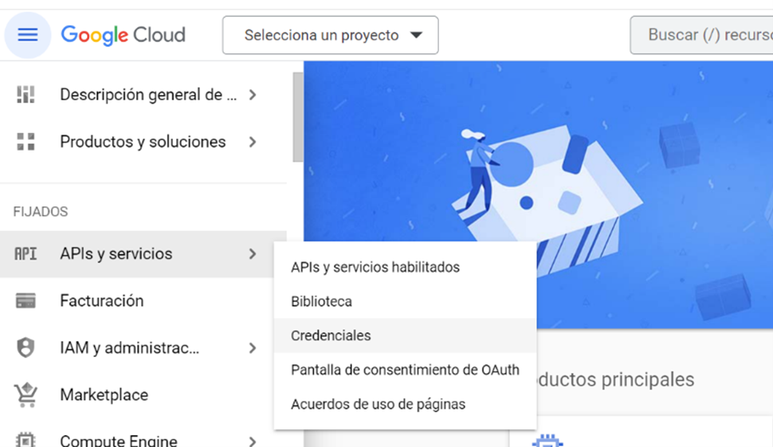
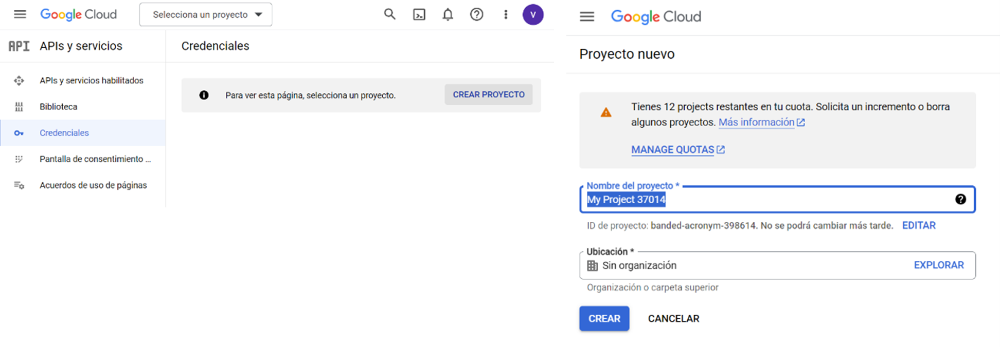
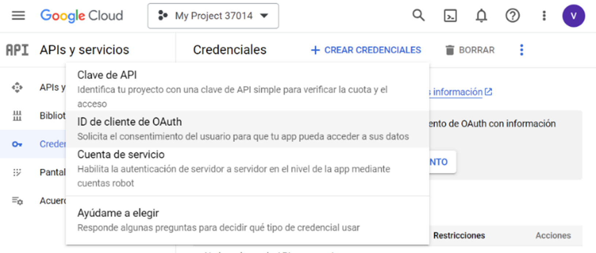
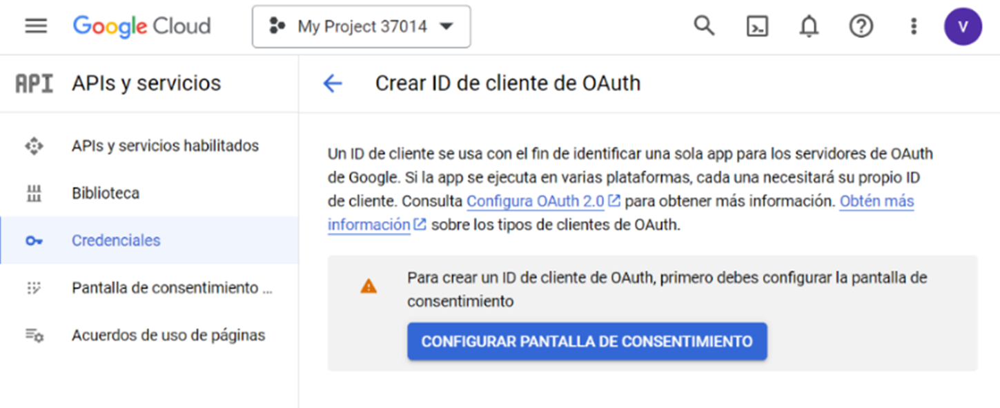
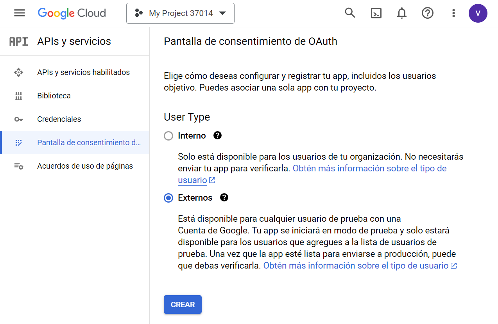
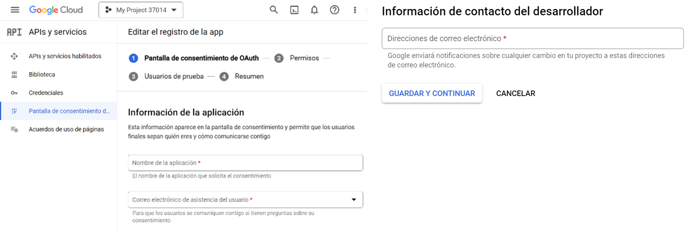
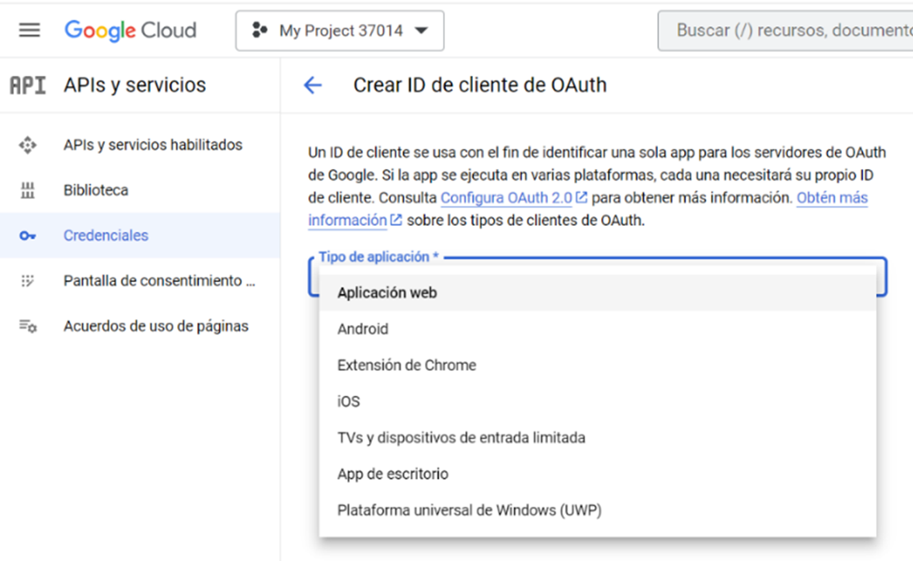
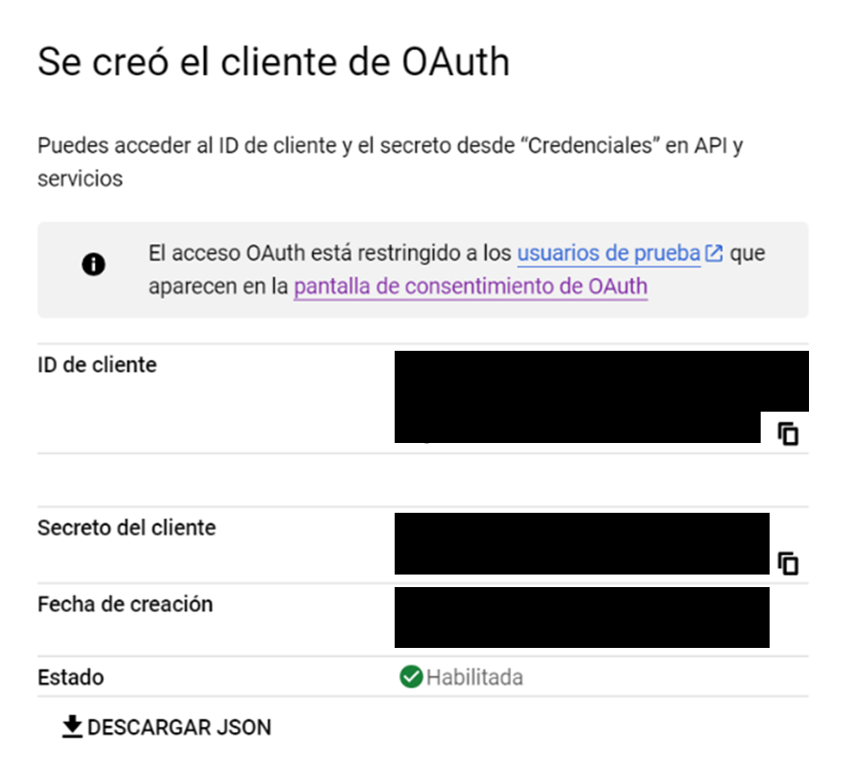
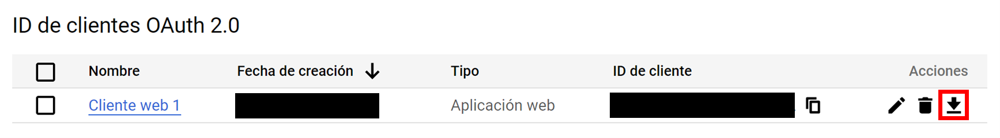

Credenciales Google Cloud
=========================

Para participar en el leaderboard de la asignatura, cada estudiante subirá los resultados obtenidos en cada ejercicio. Para ello es necesario modificar el contenido de la hoja de cálculo en Google Sheets. Para garantizar la seguridad del acceso personal, Google impone el uso de las credenciales de Google Cloud.

Para obtenerlas, es necesario expedirlas desde un correo Gmail (se recomienda no usar el @alumnos.uc3m.es, ya que no está autorizado), aunque posteriormente el **login sí se hará desde la cuenta de estudiante**.

Creación de un proyecto nuevo
-----------------------------

Si ya se ha creado previamente, saltar a la sección `Creación de credenciales`_. En caso contrario, crear un proyecto nuevo. Para ello, acceder al `panel de control de Google Cloud <https://console.cloud.google.com/>`_, seleccionar *APIs y servicios* > *Credenciales* y *Crear Proyecto*:

|

|

Creación de credenciales
------------------------

Si ya se han creado previamente, saltar a la sección `Descarga de archivo de credenciales`_. En caso contrario, crear unas credenciales nuevas:

En primer lugar, acceder al `panel de control de Google Cloud <https://console.cloud.google.com/>`_ y seleccionar *APIs y servicios* > *Credenciales*:

|

A continuación, seleccionar *Crear credenciales* > *ID de cliente de OAuth*:

|

En *Configuración de pantalla de consentimiento*:

|

Seleccionar tipo de usuario externo:

|

Introducir un nombre de aplicación cualquiera e indicar el correo Gmail en correo electrónico de asistencia y de desarrollador. Dejar todo lo demás en blanco:

|

Estos pasos son los que se deberían realizar si se quisiera crear una aplicación en Google Cloud y distribuirla como producto. Por ello, es necesario completar todas estas pantallas. **A pesar de no ser ese el propósito de esta asignatura**, la API de Google Sheets **obliga** a seguirlos igualmente.

Descarga de archivo de credenciales
-----------------------------------

Una vez creadas las credenciales, seleccionar *Crear credenciales* > *ID de cliente OAuth*, seleccionar *Aplicación web* y Crear:

|

Aparecerá una ventana para confirmar su creación, desde la cual se podrá descargar el archivo de credenciales (JSON):

|

De igual modo, se puede descargar desde el panel de *ID de clientes OAuth 2.0*:

|

.. note:: Crear una nueva carpeta en el directorio raíz del proyecto (``UC3M-PIC``), llamada ``gsheets``. En ella, guardar el archivo de credenciales con el nombre ``credentials.json`` (``UC3M-PIC/gsheets/credentials.json``)