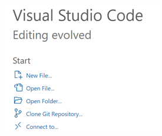
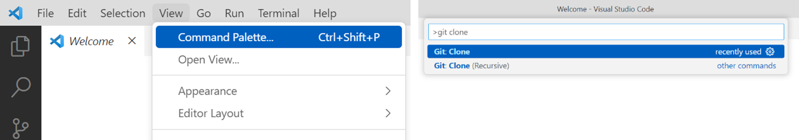
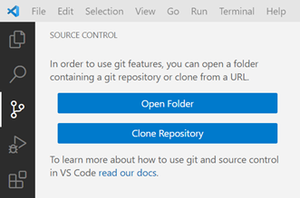

Instalación
===========

Repositorio Visión por Computador
---------------------------------

A continuación, se procede a clonar el repositorio de las prácticas de la asignatura directamente mediante VSCode, tanto desde la pantalla de bienvenida:

|

como desde la paleta de comandos (atajo: Ctrl+Shift+P):

|

o desde la pestaña de Git:

|

El repositorio es ramajoballester/UC3M-PIC: `https://github.com/ramajoballester/UC3M-PIC <https://github.com/ramajoballester/UC3M-PIC>`_.

Pytorch
-------

Seguir las indicaciones de la `página oficial <https://pytorch.org/get-started/locally/>`_. Se recomienda **instalar con conda**.

Paquete UC3M-PIC
----------------

Para instalar el paquete UC3M-PIC, ejecutar el siguiente comando en la terminal:

.. code-block:: bash

    pip install uc3m-pic

Comprobación
------------

Si todo ha sido instalado correctamente, los tests deberían pasar de forma satisfactoria:

.. code-block:: bash

    python -m unittest

.. warning::
    Es posible que se solicite instalar el paquete ipykernel

    Seleccionar kernel antes de ejecutar el notebook